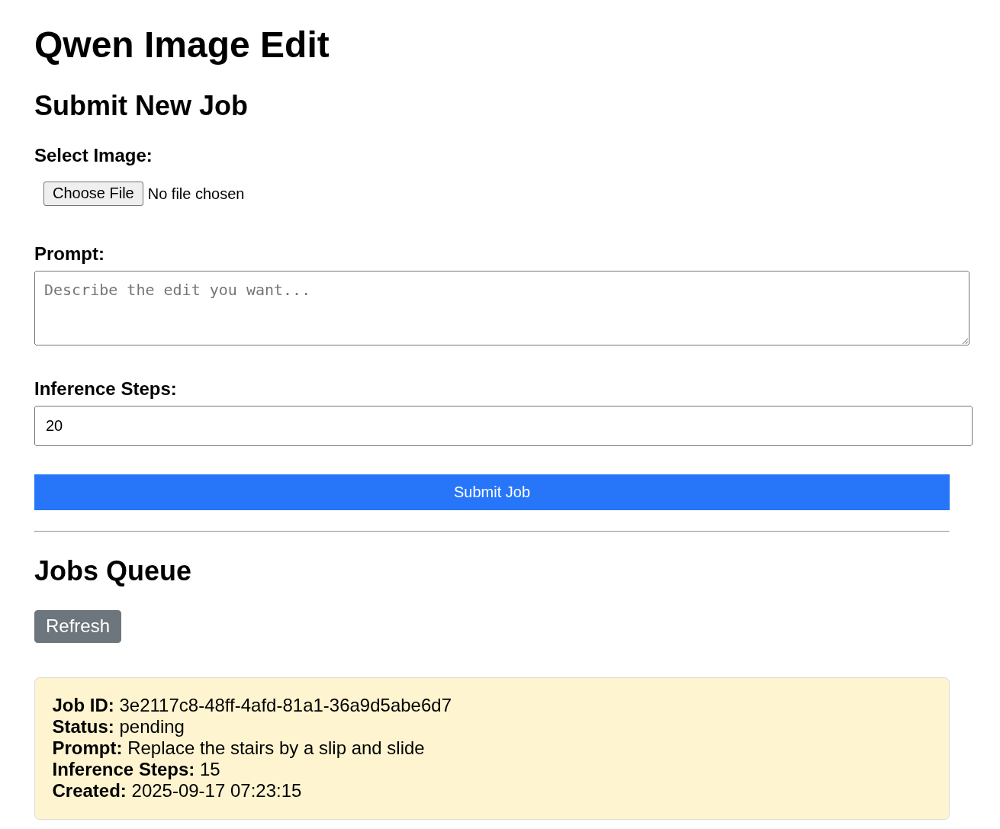
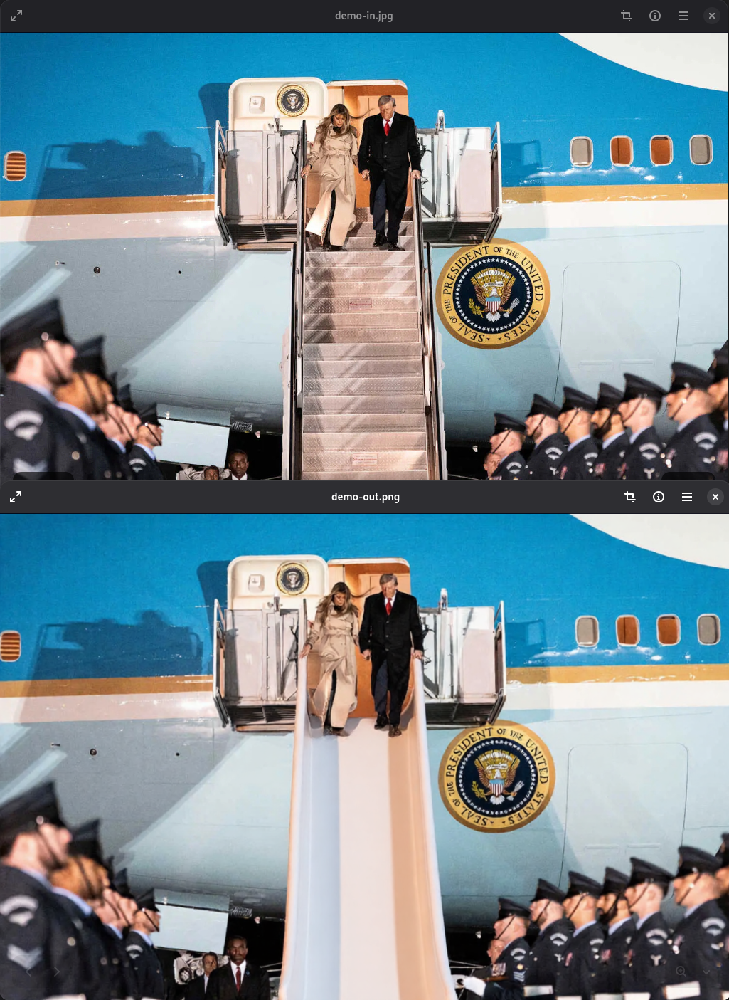

# Screenshots

> Replace the stairs by a slip and slide

# Requirements

An NVIDIA GPU with 24GB of VRAM (3090, 4090, 5090 or pro series). 

# Installation

This has been tested September 2025 on Linux Debian SID (CUDA 12.4) and Windows 11 (CUDA 12.9).

- Install miniconda (see official project documentation, or package of your distro)
- `conda env create -n qwenie -f environment.yml` (frozen versions for CUDA 12.4, you may need to tweak for other versions)
- Start the server
	- `python3.11 qwenie.py` on Linux 
	- `python qwenie.py` on Windows

## Manual installation

- `conda create -y -n qwenie python=3.11`
- `conda install -y torchvision pytorch pytorch-cuda=12.4 -c pytorch -c nvidia`
- `pip install --upgrade "git+https://github.com/huggingface/diffusers" transformers accelerate bitsandbytes safetensors pillow flask`

On linux you may also add `pip install flash-attn`

# Performance 

For a 1024x1024px image, 10 steps cost you : 
- 65sec on an RTX 3090
- 36sec on an RTX 4090

Authors of the model recommend 50 steps, but the model behaves just fine in the 15-25 range too.

Real world generation times are from 1min to 3min.

# Disclaimer

This is just a wrapper for a quantized version of [Qwen Image Edit 20B](https://qwenlm.github.io/blog/qwen-image-edit/), with a clean a easy to use webui. But it can get you going in 5 mins.

**The model sometime has a mind of its own and will change the overall picture instead of just what you asked for.** 
Reminding the model not to change anything else can sometime help, but more prompt engineering and research is required for perfectly predictable results.
